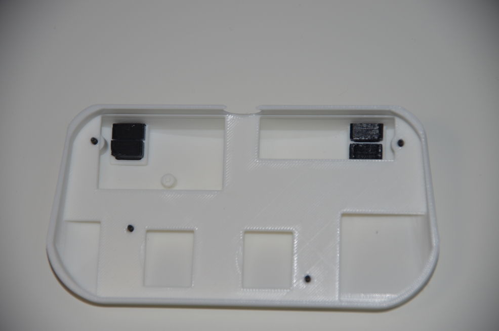

# OmniController

## Description

*OmniController* is an Open Hardware /  Open Source, all-in-one controller.

It was conceived with retrogaming solutions (such as emulators or FPGA) in mind but can accommodate to modern gaming as well. Its main goal is to cover original button layouts of most of the popular console controllers without having to remap buttons or use different controllers when playing games from different consoles libraries.

It uses the [**GP2040-CE**](https://gp2040-ce.info/) firmware which is well known for its [compatibility](https://gp2040-ce.info/usage#input-modes) with most modern and retro platforms as well as its [very low latency](https://gp2040-ce.info/#performance).

  

## Default keymap

Please note that the double L3 and R3 buttons (the ones on the joysticks and the face buttons ones) are wired in hardware. That means that if you chose, for exemple, to remap L3 to a different button, both L3s will be remapped to that button. This is due to the fact that all GPIOs available in the firmware/microcontroller are already in use. It is unlikely that you will need to use both joysticks and 6 faces buttons at the same time.

## Getting Started

### Prerequisites

Software:
- Firmware: [**GP2040-CE**](https://gp2040-ce.info/)
- (optional for modifying the PCB): [**KiCAD**](https://www.kicad.org/)
- (optional for modifying the case and buttons): [**FreeCAD**](https://www.freecad.org/)

Hardware:
- 4x M2x4x3.2 threaded inserts
- 4x M2x12 screws
- a soldering iron (to melt the inserts into the case, no actual soldering required)
- super glue
- USB-C cable
- a computer for installing the firmware

### Making the PCB

Download and extract the latest [*OmniController* release](https://github.com/rp958/omnicontroller/releases) file.

All the necessary files for PCB fabrication are located in *release/pcb/*.

Bill of materials:

| Item# | Designation                                                                                                   | Manufacturer      | Part Number    | Package               | Value              | Quantity |
|-------|---------------------------------------------------------------------------------------------------------------|-------------------|----------------|-----------------------|--------------------|----------|
| 1     | A1, B1, BOOT_SEL1, Credit1, DOWN1, L1, L2, LEFT1, Menu1, RIGHT1, SEL1, START1, UP1, X1, Y2, Z1, bC1, bR1, bR2 | Omron Electronics | B3FS-1000P     |                       |                    | 12       |
| 2     | C1, C2                                                                                                        |                   |                | 0805 (2012 Metric)    | 10u capacitor      | 2        |
| 3     | C10, C11                                                                                                      |                   |                | 0805 (2012 Metric)    | 1u capacitor       | 2        |
| 4     | C12, C13, C14, C3, C4, C5, C6, C7, C8, C9                                                                     |                   |                | 0805 (2012 Metric)    | 100n capacitor     | 10       |
| 5     | C15, C16                                                                                                      |                   |                | 0805 (2012 Metric)    | 15p capacitor      | 2        |
| 6     | LeftStick1, RightStick1                                                                                       | Alps              | RKJXV122400R   | (THT)                 |                    | 2        |      
| 7     | P1                                                                                                            | G-Switch          | GT-USB-7010ASV |                       |                    | 1        |
| 8     | R1, R2                                                                                                        |                   |                | 0805 (2012 Metric)    | 27.4 ohms resistor | 2        |
| 9     | R3, R4                                                                                                        |                   |                | 0805 (2012 Metric)    | 1k resistor        | 2        |
| 10    | U1                                                                                                            | Raspberry Pi      | RP2040         | QFN-56 7×7mm          |                    | 1        |
| 11    | U2                                                                                                            | Onsemi            | NCP1117ST33T3G | SOT-223-3_TabPin2     |                    | 1        |
| 12    | U3                                                                                                            | Winbond           | W25Q128JVSIM   | SOIC 208-mil          |                    | 1        |
| 13    | Y1                                                                                                            | Abracon           | ABM8-272-T3    | Crystal SMD 3225 4Pin |                    | 1        |

### 3D Printing the case and buttons

You will need to print the following parts (all contained in *release/case/*).

Buttons:
- [ ] 1x dpad_bottom
- [ ] 1x dpad_top
- [ ] 2x joystick
- [ ] 2x button_select_start
- [ ] 2x button_cred_home
- [ ] 4x button_L_R
- [ ] 6x button_face 

Case:
- [ ] 1x case_back
- [ ] 1x case_front
- [ ] 1x middle_frame

For better printing results, it is recommended the following parts be sliced at an angle of 45 degrees and with supports:
- the joysticks
- case_top
- case_bottom

All the other parts should be printed flat and do not require any support.

Please note that depending on the quality and precision of your print, you might have to sand some parts.

### Assembling

1. Take the 2 parts of the D-Pad and glue them together back to back, making sure the two holes are aligned. 
2. Take the case bottom and start to screw the M2 screws from the bottom. 
2. Insert the middle frame aligning the holes with the M2 screws, then place the L1, L2, R1 and R2 buttons. 
3. Place the PCB aligning the holes with the M2 screws. Adjust the screws so that they are flush with the PCB. 
4. Take the case top and melt the M2 threaded inserts into it using the soldering iron. 
5. Place all the face controls in their respective place. Make sure the rectangular holes in the back of the joysticks are placed horizontally. 
6. Turn the back assembly onto the top making sure the joystick axes go into the rectangular holes. 
7. Slowly screw the M2 screws making sure they are facing the threaded inserts. Screw them firmly but not too tight. 
8. You're done!

### Flashing the firmware

1. Download the latest version of **GP2040-CE** from the project's [download page](https://gp2040-ce.info/downloads). You must use the link for the **Raspberry Pi Pico** microcontroller.
2. Unplug your controller.
3. Use a pin or an unfolded paperclip to press the reset button at the back of the controller. 
4. While pressing the reset button, plug the controller to your computer. Your computer should detect your controller as a mass storage device.
5. Copy the *.uf2* firmware file to the controller memory.
6. Once the file copy is finished, the controller should restart and be detected as an XInput (XBox360) controller by default.

Please refer to the [**GP2040-CE** installation documentation](https://gp2040-ce.info/installation) for more details.

### Recommended configuration

1. Unplug your controller.
2. Download the default [*omnicontroller_default.gp2040*](conf/omnicontroller_default.gp2040) configuration file on your computer.
3. Press and hold the S2 button. While still holding S2, plug the controller to your computer. Your computer should detect your controller as a network adapter.
4. Open the following URL in your Web Browser: [http://192.168.7.1](http://192.168.7.1). This should bring you to the *Web Configurator* interface.
5. Go to *Configuration* > *Data Backup and Restoration*.
6. Click on *Load* and select the *omnicontroller_default.gp2040* file you downloaded at step 2.
7. Click the *REBOOT* button, then *Controller*.

Please refer to the [**GP2040-CE** *Web Configurator* documentation](https://gp2040-ce.info/web-configurator/) for more details.

### Usage
 
Please refer to the [**GP2040-CE** usage documentation](https://gp2040-ce.info/usage)

### Troubleshooting

In case of problems, you can use **Hardware Tester's** [gamepad controller](https://hardwaretester.com/gamepad) in order to make sure you controller is detected correctly and that all buttons are functioning.

## Roadmap

- Move L1, L2, R1 and R2 buttons to the topside of the controller, as per most controllers shoulder buttons/triggers.

## Known issues / Limitations

- At this stage, *Host USB* authentication mode for PS4/PS5 is not implemented. So only PS4 key file authentication is supported on PS4/PS5. Please read [*Additionnal PS4 settings*](https://gp2040-ce.info/web-configurator/menu-pages/settings/#additional-ps4-settings) from **GP2040-CE** *Settings* documentation.

## License

Distributed under CERN-OHL-S version 2 or later. See [licence text](https://ohwr.org/cern_ohl_s_v2.txt) for more information.

## Contact

Please [e-mail me](mailto:omnicontroller@proton.me) if you want to contribute, especially if you have experience in electronics engineering, CAD or manufacturing.

## Attributions

OmniController uses the [SnapEDA Alps RKJXV122400R joystick footprint](https://www.snapeda.com/parts/RKJXV122400R/ALPS/view-part/).

## Acknowledgments

Many thanks go to the [**GP2040-CE**](https://gp2040-ce.info/) development team.

## Help

If you want to help funding this project, any contribution is greatly welcome. This can help me acquire some prototyping equipment and spend more time on the development. To do so, please use my:

- [  Patreon](https://www.patreon.com/omnicontroller) page.
- [  Ko-fi](https://ko-fi.com/omnicontroller) page.